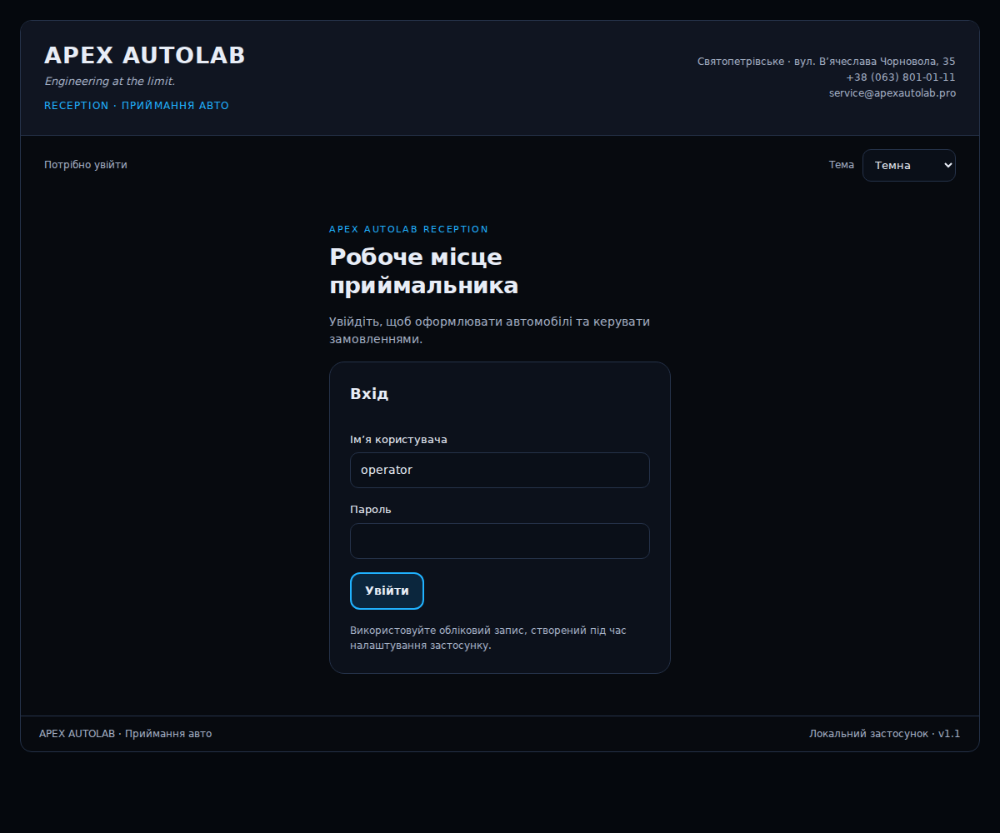
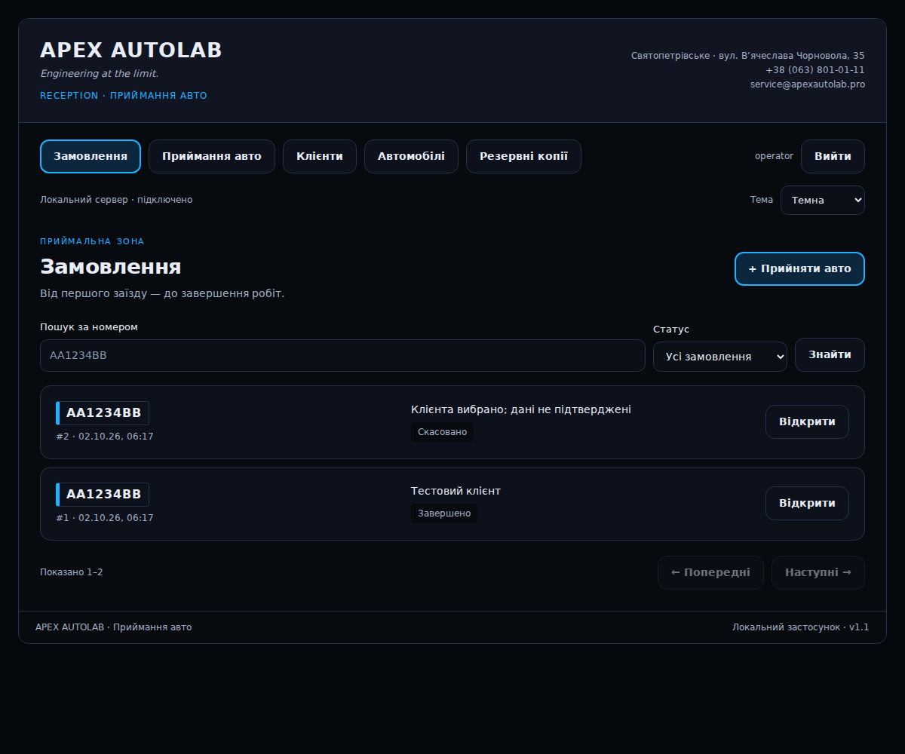
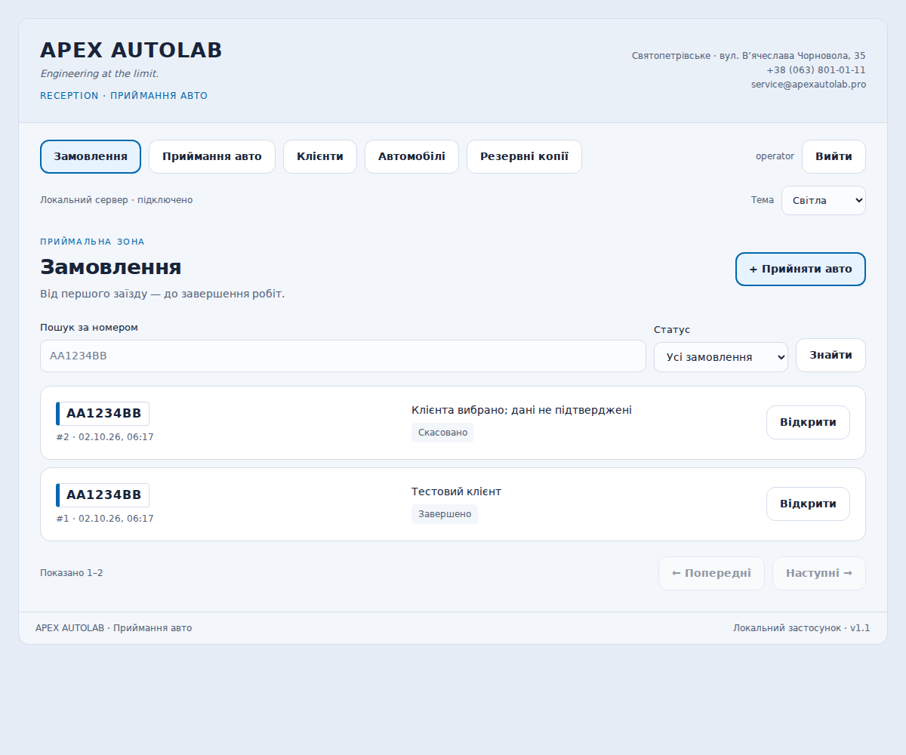

# Практичне заняття №18 — розробка Front-end

**Проєкт:** APEX AutoLab Reception. **Виконавець:** Яковенко Олександр Володимирович, КН-41.

## Мета та результат

Реалізовано адаптивний інтерфейс для локального застосунку приймальника СТО. Дизайн відповідає погодженому макету та стилю APEX Advisor: графітові поверхні, сині акценти, заокруглені кнопки, шапка APEX AUTOLAB. Доступні світла, темна й системна теми. Вибір теми зберігається в localStorage; пароль, токен сесії, контакти та наряди туди не записуються.

Демонстраційні масиви попереднього прототипу замінено реальними REST-запитами. Дані надходять із SQLite через Flask API та зберігаються після перезапуску. Сторінка відкривається за адресою `http://127.0.0.1:8765/` після запуску `manage.py serve`. Браузер і API працюють з одного origin. Окремий сервер Front-end, збірка або Node.js для роботи застосунку не потрібні.

## Екрани та взаємодія

| Екран | Функції | API |
|---|---|---|
| Вхід | Обліковий запис оператора, повідомлення про неправильний пароль, вихід | GET csrf/me; POST login/logout |
| Замовлення | Пошук за номером, статус, пагінація по 20, порожній список | GET /api/orders |
| Приймання | Ручний номер, підтвердження, нова чернетка або відкриття активного наряду | POST /api/orders |
| Розпізнавання | JPEG/PNG, попередній перегляд, локальне OCR, ручне виправлення | POST /api/ocr |
| Наряд | Клієнт, звернення, примітки, статуси, історія, вкладення | GET/PATCH orders; PATCH status; POST/GET attachments |
| Клієнти | Пошук, створення, редагування, видалення непов’язаного клієнта | GET/POST/PATCH/DELETE clients |
| Автомобілі | Пошук, VIN, марка, модель, постійний клієнт, історія візитів | GET/PATCH vehicles; GET vehicles/{id}/orders |
| Резервні копії | Створення та завантаження ZIP | GET/POST backups; GET backups/{id} |

Пошук клієнта для прив’язування до наряду реалізовано окремим діалогом із пагінацією по 10 записів. Він не обмежений першими 100 клієнтами бази. Новий клієнт спочатку зберігається в довіднику, потім прив’язується кнопкою «Зберегти зміни» в наряді. Ці дві операції явно розділені в повідомленні інтерфейсу.

## Модульність

| Файл | Відповідальність |
|---|---|
| apex/templates/index.html | Оболонка, навігація, області повідомлень, діалог |
| apex/static/css/app.css | Кольори, типографіка, адаптивність, теми |
| apex/static/js/theme.js | Вибір і збереження теми |
| apex/static/js/api.js | fetch, CSRF, тайм-аути, помилки, завантаження файлів |
| apex/static/js/components.js | Поля, кнопки, статуси, пагінація, екранування тексту |
| apex/static/js/views.js | Формування ключових екранів |
| apex/static/js/app.js | Навігація, події, стан форм, оркестрація API |

Використано HTML5, CSS та JavaScript ES Modules без додаткового UI-фреймворку. Це відповідає обсягу локального MVP і зменшує кількість залежностей. Серверні бізнес-правила залишаються авторитетними; клієнтська перевірка лише допомагає оператору.

## Стани інтерфейсу

- **Завантаження:** видимий текст стану, aria-busy та тимчасове блокування повторних операцій.
- **Успіх:** повідомлення після підтвердження сервера та оновлення даних.
- **Валідація:** HTML required/maxlength та повідомлення сервера; введені поля зберігаються при 422.
- **Порожній результат:** пояснення замість порожньої таблиці; пошук залишається доступним.
- **401:** неправильний пароль або повернення до входу після завершення сесії.
- **409:** зрозуміле повідомлення про конфлікт, наприклад видалення пов’язаного клієнта.
- **503/504 OCR:** повідомлення та можливість ручного введення номера.
- **Мережева помилка/тайм-аут:** пояснення; для невизначеного результату запису пропонується перевірити дані. Автоматичного повторення таких записів немає.
- **CSRF:** при явному csrf_failed оновлюється токен і один раз повторюється відхилений запит. Успішні або невизначені операції не повторюються автоматично.
- **Незбережені зміни:** запуск робіт заблоковано; при виході зі сторінки показується підтвердження.

Готовність потребує клієнта, телефона, звернення й підтвердження. При зміні клієнта або звернення готовий наряд повертається до чернетки. Оновлення лише приміток зберігає готовність. У роботі змінюються примітки та додаються фото; закритий наряд не редагується.

## Безпека

Збережено автентифікацію, серверні сесії, CSRF, перевірку локальної адреси та Host. Публічними стали лише HTML-оболонка й статичні ресурси; API з даними, вкладеннями та копіями потребує входу. CSP дозволяє локальні скрипти/стилі та API, блокує inline-скрипти, eval і вбудовування у сторонні iframe. Дані користувача екрануються перед вставленням у HTML. Завантаження фото перевіряється на сервері.

## Перевірка

Див. `FRONTEND_TESTING.md` та `frontend-e2e-results.json`. Перевірки виконані зі справжнім Waitress, тимчасовою SQLite, HTTP API й Chromium. Тестові дані не входять у робочий каталог instance. Для відмов OCR і мережі додатково використано контрольовані відповіді/переривання запитів у браузері.

## Межі MVP і подальша робота

Програма працює локально з одним оператором. Відеопотік, автоматичний детектор номерів, ROApp, друк наряду, облік робіт/запчастин і мережевий багатокористувацький режим поки не реалізовані. OCR очікує фото номерного знака; його результат перевіряє людина. Інтерфейс показує час у часовому поясі браузера, база зберігає UTC. Відновлення копії виконується через CLI при зупиненому сервері.

Для використання на СТО наступні кроки: випробування на реальних фото й робочих сценаріях приймальника, перевірка на конкретному Mac/Windows, процедура резервного копіювання, друк наряду та подальше підключення відео. Перевірка в Linux/Chromium не замінює такого пілоту.

## Знімки реалізованого інтерфейсу

